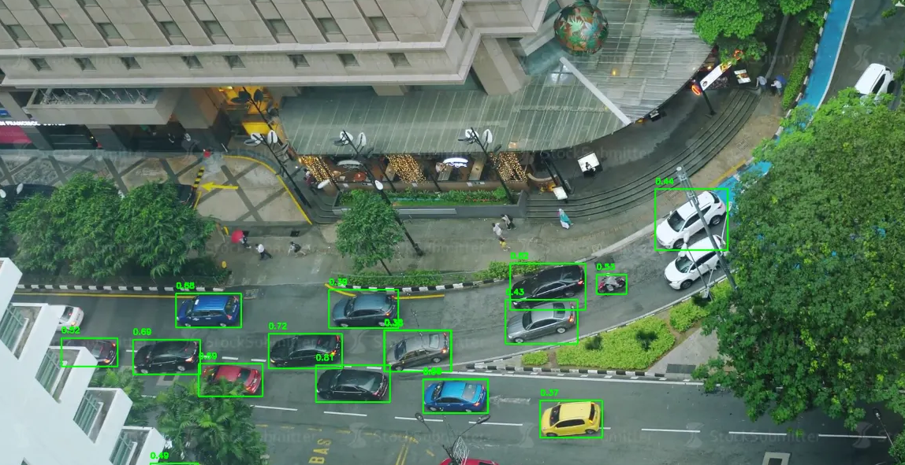
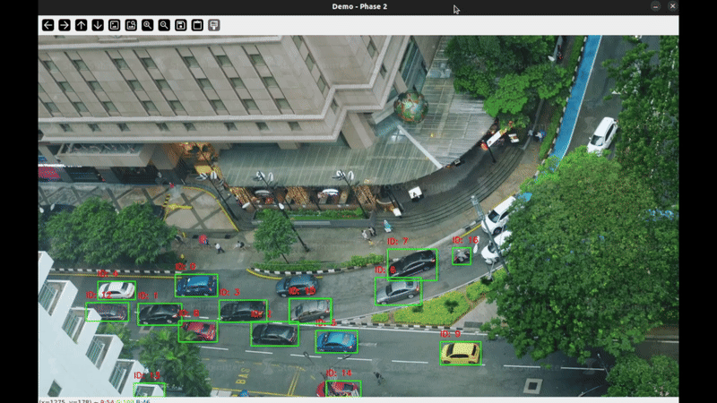
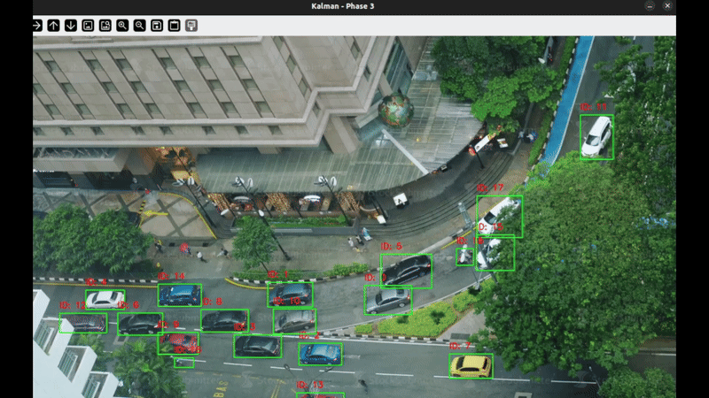

# Traffic Insight Robotics: Multi-Object Tracking & State Estimation

## Project Description
This project focuses on **Multi-Object Tracking (MOT)** and **State Estimation** in dynamic traffic environments. As a statistics student interested in robotics and computer vision, my primary goal is to understand the mathematics behind tracking algorithms rather than relying solely on pre-built tracking libraries.

The system detects vehicles in a video stream, assigns unique IDs to them, and tracks their movement across frames. It specifically addresses real-world challenges such as occlusion (vehicles passing under trees) and signal noise using custom logic.

## Technical Implementation

### 1. Vehicle Detection
For the detection phase, I utilized **YOLOv8**. To ensure the system focuses only on relevant traffic data, I implemented a class filter based on the COCO dataset, strictly detecting: Cars, Motorcycles, Buses, and Trucks.

The initial phase involved only detecting objects in each frame independently, without any tracking identities.

**Initial Detection Phase (No Tracking)**



*(Fig 1: Early stage output showing bounding boxes and confidence scores only.)*

### 2. Custom Centroid Tracking
Instead of using an off-the-shelf tracker, I implemented a custom **Centroid Tracking Algorithm**. This algorithm converts bounding box coordinates into a center point (cx, cy) for each object.

**Centroid Calculation Formula:**

$$
C_x = \frac{x_1 + x_2}{2}, \quad C_y = \frac{y_1 + y_2}{2}
$$

To associate detections between consecutive frames, the system calculates the 

**Euclidean Distance** between existing object centers and new detections.

**Euclidean Distance Formula:**

$$
\text{Distance} = \sqrt{(x_2 - x_1)^2 + (y_2 - y_1)^2}
$$

If the distance is below a specific threshold, the algorithm associates the new detection with the existing ID.

### 3. Handling Occlusions & Persistence (Memory Buffer)
A major challenge in the test footage was vehicles disappearing under trees. To solve this, I implemented a **persistence buffer**.
* When an object is not detected in the current frame, the system does not delete it immediately.
* Instead, it keeps the object in memory for a set number of frames.
* **Note:** This concept is standardly known as **'max_age'** in MOT literature; it is implemented as the `max_disappeared` parameter in this codebase.
* This approach prevents ID switching and allows the tracker to "re-catch" the vehicle once it emerges from the occlusion.

### 4. Noise Reduction & ROI Filtering
To improve tracking stability and eliminate false positives (such as signs or pedestrians being misclassified), I applied two filtering techniques:
* **Area Filtering:** Objects below a certain pixel area are ignored to filter out noise, with specific exceptions made for smaller vehicles like motorcycles.
* **Spatial Filtering (ROI):** Static false positives caused by background structures were eliminated by defining hard-coded exclusion zones in the coordinate system.

```python
# Example of Area & ROI Filtering Logic implemented in the project
area = w * h
min_area_th = 1500

# Area Filter
if area < min_area_th and class_id != 3:
    continue

# ROI Filter (Ignoring specific coordinates)
if (630 < x < 840) and (200 < y < 420):
    continue
```
**Tracking with Occlusion Handling & Filtering**



*(Fig 2: Current system performance demonstrating stable ID assignment even under occlusions.)*

## Kalman Filter Implementation

To handle detection noise and temporary occlusions, a Linear Kalman Filter is implemented with a Constant Velocity Model.

### State Vector
The state of each vehicle is represented by its position ($x, y$) and velocity ($v_x, v_y$):

$$
\mathbf{x} = \begin{bmatrix} x & y & v_x & v_y \end{bmatrix}^T
$$

### Motion Model
The state transition is based on the following kinematic equation, allowing the system to predict the vehicle's position even when detection fails:

$$
\mathbf{x}_{k} = \mathbf{F} \cdot \mathbf{x}_{k-1} \quad \Rightarrow \quad 
\begin{bmatrix} x' \\ y' \\ v_x' \\ v_y' \end{bmatrix} = 
\begin{bmatrix} 
1 & 0 & \Delta t & 0 \\ 
0 & 1 & 0 & \Delta t \\ 
0 & 0 & 1 & 0 \\ 0 & 0 & 0 & 1 
\end{bmatrix} 
\begin{bmatrix} x \\ y \\ v_x \\ v_y \end{bmatrix}
$$

## Kalman Filter Phase



*(Fig 3. Kalman Filter State Estimation)*

## Future Improvements

* **Data Association:** Currently, the tracker uses a Nearest Neighbor approach. To solve ID switching during occlusions, the Hungarian Algorithm will be integrated for global cost optimization.
* **Model Optimization:** The detection model has been updated to use VisDrone weights to improve accuracy on top-down aerial views.

## 5. References & Credits
The traffic footage used in this project was sourced from YouTube for educational and testing purposes.
* **Original Video:** [Watch on YouTube](https://www.youtube.com/watch?v=2WF63sFQDe4)